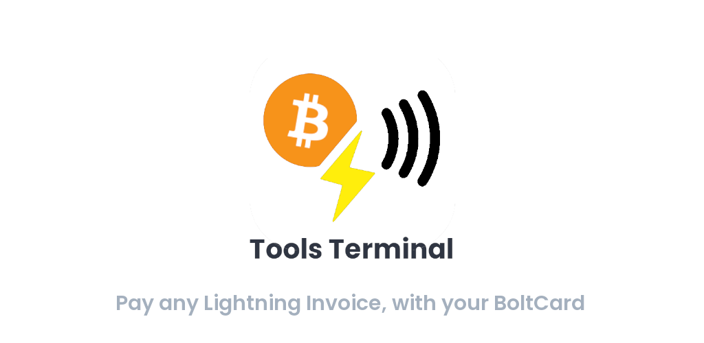

# BoltCard Terminal Tools app


Have you ever tried to pay via Lightning with your BoltCard, but the merchant's Point-of-Sale doesn't support it?
With this simple app, you can scan his invoice with your phone, tap your BoltCard on your phone, to pay him directly, in Peer-2-Peer, from your node to his node.

You can also pay Onchain invoices with your BoltCard seamlessly using Swiss Bitcoin Pay's integrated swap service.

[](LICENSE)

[](https://github.com/SwissBitcoinPay/boltcard-tools-terminal)

## 🔍 Features

- 📱 **Native iOS/Android app**
- 💳 **Pay Lightning invoices on any device with your [BoltCard](https://github.com/boltcard/boltcard)**
- 🕵🏻 **No tracker or data sent to external servers**

## 🌐 Supported languages
- 🇬🇧 English

## ⚙️ Tech stack
- [React](https://react.dev)
- [React Native](https://reactnative.dev)

## 🧰 How to run
Install packages
```sh
npm install
npm run mobile-start
```

Then, in a separate terminal:

##### iOS
```sh
cd ios && pod install && cd ..
npm run ios
```

##### Android
```sh
npm run android
```

## 🤝 Contributing
- PRs are welcomed! Some ideas:
  - Add your language
  - Imagine a new cool feature for BoltCard's users
  - Improve testing & security